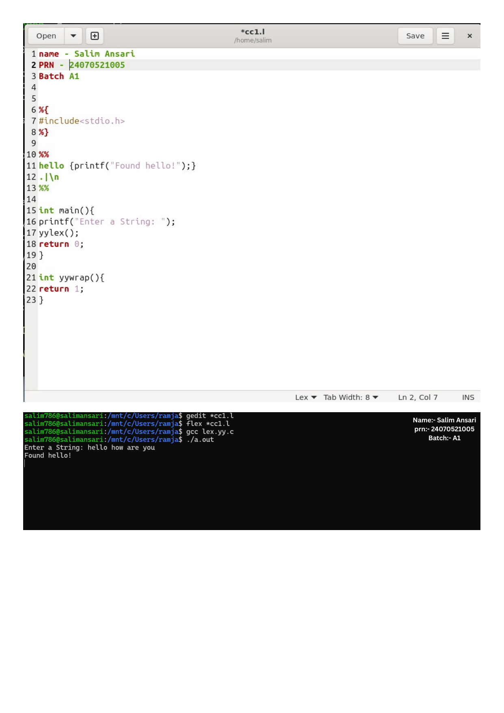

# Practical 1: Introduction to Lexical Analyzer (LEX)

> **Student Name:** Salim Ansari | **PRN:** 24070521005 | **Batch:** A1

## 📋 Description
Demonstrates basic Lex pattern matching (recognizing strings like `hello`) and counting single-line comments in source code.

## 📁 Source Files
- [`1.1_basic_lex.l`](./1.1_basic_lex.l)
- [`1.2_count_comments.l`](./1.2_count_comments.l)

## 🚀 How to Run
```bash
# 1. Generate C scanner with Flex
flex 1.1_basic_lex.l

# 2. Compile with GCC
gcc lex.yy.c -o out

# 3. Execute
./out
```

## 🖥️ Output / Execution Screenshot



📄 **Full PDF Lab Report:** [`Practical-01.pdf`](./Practical-01.pdf)
