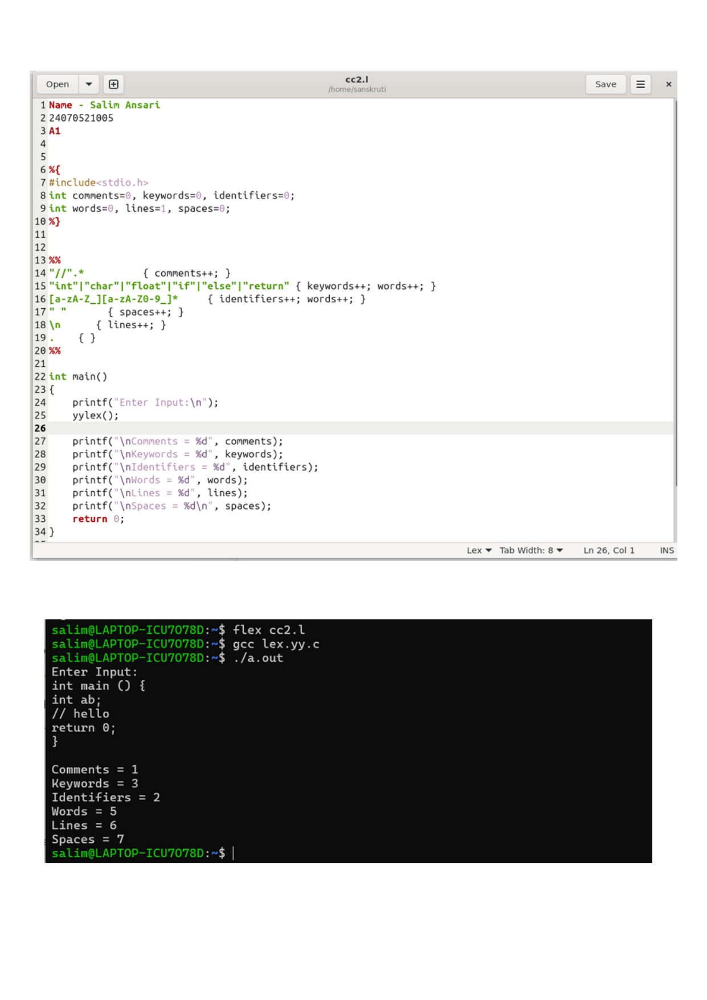

# Practical 2: Token Counting in Lex

> **Student Name:** Salim Ansari | **PRN:** 24070521005 | **Batch:** A1

## 📋 Description
A Lex program to count total comments, keywords, identifiers, words, lines, and spaces from given input code.

## 📁 Source Files
- [`count_tokens.l`](./count_tokens.l)

## 🚀 How to Run
```bash
# 1. Generate C scanner with Flex
flex count_tokens.l

# 2. Compile with GCC
gcc lex.yy.c -o out

# 3. Execute
./out
```

## 🖥️ Output / Execution Screenshot



📄 **Full PDF Lab Report:** [`Practical-02.pdf`](./Practical-02.pdf)
