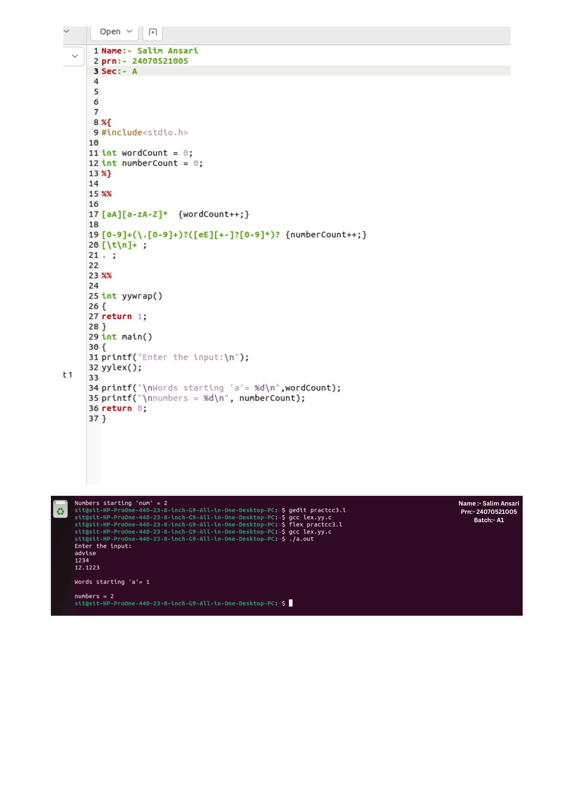

# Practical 3: Identification of Numbers & Words Starting with 'a'

> **Student Name:** Salim Ansari | **PRN:** 24070521005 | **Batch:** A1

## 📋 Description
A Lex program to identify and count words starting with letter 'a' / 'A' and various numeric literals (integers, floating point numbers, and exponential forms).

## 📁 Source Files
- [`count_words_and_numbers.l`](./count_words_and_numbers.l)

## 🚀 How to Run
```bash
# 1. Generate C scanner with Flex
flex count_words_and_numbers.l

# 2. Compile with GCC
gcc lex.yy.c -o out

# 3. Execute
./out
```

## 🖥️ Output / Execution Screenshot



📄 **Full PDF Lab Report:** [`Practical-03.pdf`](./Practical-03.pdf)
