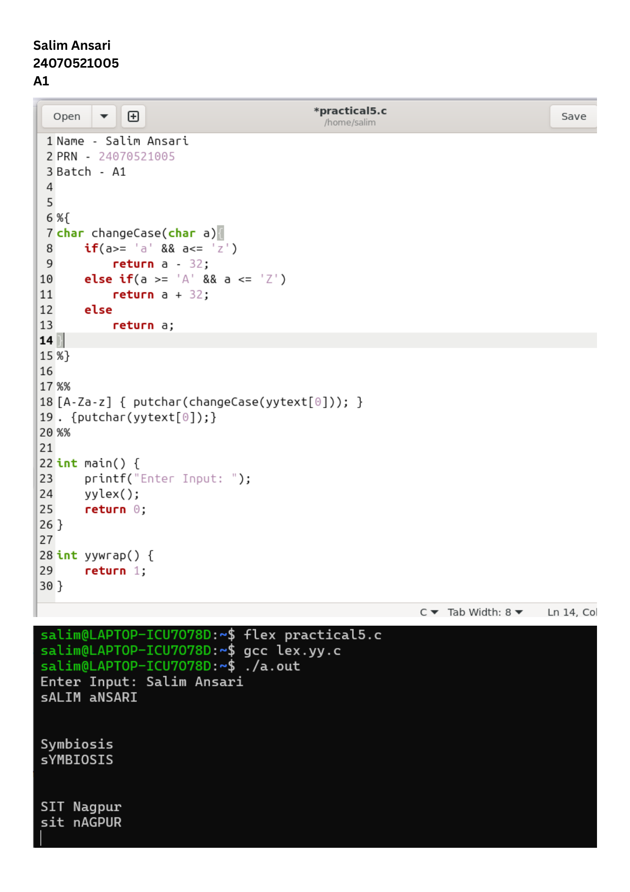

# Practical 5: Conversion of Uppercase to Lowercase and Vice Versa

> **Student Name:** Salim Ansari | **PRN:** 24070521005 | **Batch:** A1

## 📋 Description
A Lex program that toggles character case: converts uppercase letters to lowercase and lowercase letters to uppercase.

## 📁 Source Files
- [`toggle_case.l`](./toggle_case.l)

## 🚀 How to Run
```bash
# 1. Generate C scanner with Flex
flex toggle_case.l

# 2. Compile with GCC
gcc lex.yy.c -o out

# 3. Execute
./out
```

## 🖥️ Output / Execution Screenshot



📄 **Full PDF Lab Report:** [`Practical-05.pdf`](./Practical-05.pdf)
