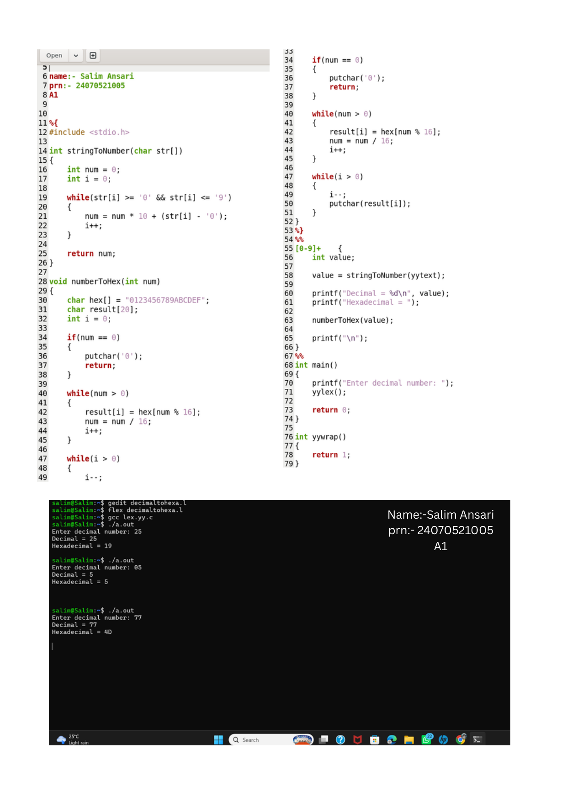
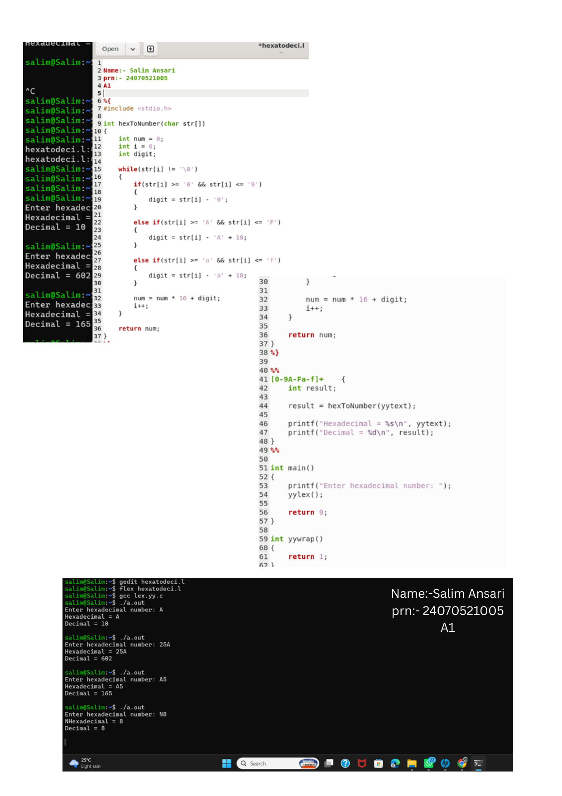

# Practical 6: Decimal and Hexadecimal Number System Conversion

> **Student Name:** Salim Ansari | **PRN:** 24070521005 | **Batch:** A1

## 📋 Description
Lex programs to convert Decimal numbers to Hexadecimal format and Hexadecimal numbers to Decimal format.

## 📁 Source Files
- [`decimal_to_hexadecimal.l`](./decimal_to_hexadecimal.l)
- [`hexadecimal_to_decimal.l`](./hexadecimal_to_decimal.l)

## 🚀 How to Run
```bash
# 1. Generate C scanner with Flex
flex decimal_to_hexadecimal.l

# 2. Compile with GCC
gcc lex.yy.c -o out

# 3. Execute
./out
```

## 🖥️ Output / Execution Screenshot





📄 **Full PDF Lab Report:** [`Practical-06.pdf`](./Practical-06.pdf)
