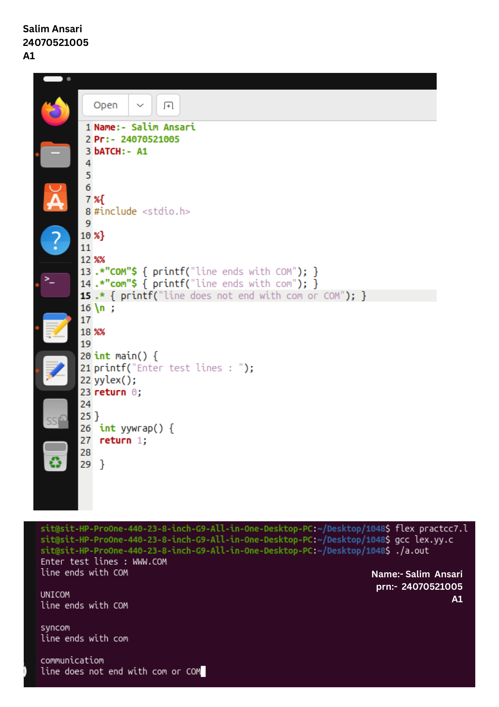

# Practical 7: String Pattern Verification (Ending with 'com')

> **Student Name:** Salim Ansari | **PRN:** 24070521005 | **Batch:** A1

## 📋 Description
A Lex program to test whether input lines end with 'com' or 'COM'.

## 📁 Source Files
- [`check_ends_with_com.l`](./check_ends_with_com.l)

## 🚀 How to Run
```bash
# 1. Generate C scanner with Flex
flex check_ends_with_com.l

# 2. Compile with GCC
gcc lex.yy.c -o out

# 3. Execute
./out
```

## 🖥️ Output / Execution Screenshot



📄 **Full PDF Lab Report:** [`Practical-07.pdf`](./Practical-07.pdf)
